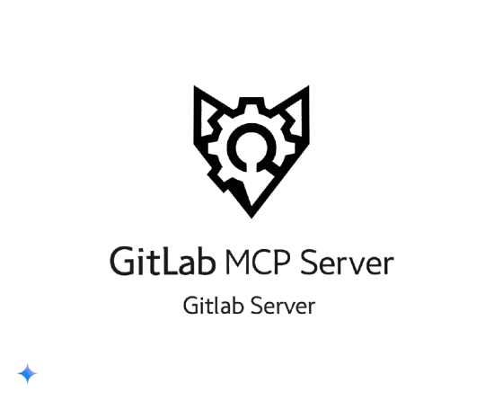

# GitLab MCP Server

<p align="center">
  
</p>

<p align="center">
  <a href="https://www.npmjs.com/package/@yoda.digital/gitlab-mcp-server">
    
  </a>
  <a href="https://github.com/yoda-digital/mcp-gitlab-server/blob/main/LICENSE">
    
  </a>
  <a href="https://github.com/yoda-digital/mcp-gitlab-server/actions">
    
  </a>
  <a href="https://github.com/yoda-digital/mcp-gitlab-server/issues">
    
  </a>
  <a href="https://github.com/yoda-digital/mcp-gitlab-server/stargazers">
    
  </a>
</p>

<p align="center">
  <b>A powerful Model Context Protocol (MCP) server for GitLab integration, enabling AI assistants to interact with your GitLab resources.</b>
</p>

## ✨ Features

- **Comprehensive GitLab API Integration** - Access repositories, issues, merge requests, wikis, and more
- **Both Transports Supported** - Use with stdio or Server-Sent Events (SSE)
- **Consistent Response Formatting** - Standardized pagination and response structures
- **Strong TypeScript Typing** - Built with the MCP SDK for type safety
- **Complete Documentation** - Examples for all available tools

### 🔍 Supported Operations

- **Repository Management** - Search, create, fork repositories
- **File Handling** - Read, create, update files
- **Branch Operations** - Create and manage branches
- **Issue Tracking** - Create, list, filter issues
- **Merge Requests** - Create, list, review merge requests
- **Group Management** - List group projects and members
- **Project Activity** - Track events and commit history
- **Wiki Management** - Full support for project and group wikis with attachments
- **Member Management** - List and manage project/group members

## 🚀 Getting Started

### Installation

#### From npm (Recommended)

```bash
npm install @yoda.digital/gitlab-mcp-server
```

#### From Source

```bash
# Clone the repository
git clone https://github.com/yoda-digital/mcp-gitlab-server.git
cd mcp-gitlab-server

# Install dependencies
npm install

# Build the project
npm run build
```

### Configuration

#### Environment Variables

The server requires the following environment variables:

| Variable                       | Required | Default                     | Description                        |
| ------------------------------ | -------- | --------------------------- | ---------------------------------- |
| `GITLAB_PERSONAL_ACCESS_TOKEN` | Yes      | -                           | Your GitLab personal access token  |
| `GITLAB_API_URL`               | No       | `https://gitlab.com/api/v4` | GitLab API URL                     |
| `PORT`                         | No       | `3000`                      | Port for SSE transport             |
| `USE_SSE`                      | No       | `false`                     | Set to 'true' to use SSE transport |

#### MCP Settings Configuration

Add the GitLab MCP server to your MCP settings file:

```json
{
  "mcpServers": {
    "gitlab": {
      "command": "npx",
      "args": ["-y", "@yoda.digital/gitlab-mcp-server"],
      "env": {
        "GITLAB_PERSONAL_ACCESS_TOKEN": "your_token_here",
        "GITLAB_API_URL": "https://gitlab.com/api/v4"
      },
      "alwaysAllow": [],
      "disabled": false
    }
  }
}
```

### Usage

#### With stdio transport (default)

```bash
# Set your GitLab personal access token
export GITLAB_PERSONAL_ACCESS_TOKEN=your_token_here

# Run the server
npm start
```

#### With SSE transport

```bash
# Set your GitLab personal access token and enable SSE
export GITLAB_PERSONAL_ACCESS_TOKEN=your_token_here
export USE_SSE=true
export PORT=3000  # Optional, defaults to 3000

# Run the server
npm start
```

#### With npx

```bash
# Run directly with npx
GITLAB_PERSONAL_ACCESS_TOKEN=your_token_here npx @yoda.digital/gitlab-mcp-server
```

## 🛠️ Available Tools

### Repository Operations

<details>
<summary><b>search_repositories</b>: Search for GitLab projects</summary>

```json
{
  "search": "project-name",
  "page": 1,
  "per_page": 20
}
```

</details>

<details>
<summary><b>create_repository</b>: Create a new GitLab project</summary>

```json
{
  "name": "new-project",
  "description": "A new project",
  "visibility": "private",
  "initialize_with_readme": true
}
```

</details>

<details>
<summary><b>fork_repository</b>: Fork a GitLab project</summary>

```json
{
  "project_id": "username/project",
  "namespace": "target-namespace"
}
```

</details>

<details>
<summary><b>list_group_projects</b>: List all projects within a specific GitLab group</summary>

```json
{
  "group_id": "group-name",
  "archived": false,
  "visibility": "public",
  "include_subgroups": true,
  "page": 1,
  "per_page": 20
}
```

</details>

### File Operations

<details>
<summary><b>get_file_contents</b>: Get the contents of a file from a GitLab project</summary>

```json
{
  "project_id": "username/project",
  "file_path": "path/to/file.txt",
  "ref": "main"
}
```

</details>

<details>
<summary><b>create_or_update_file</b>: Create or update a single file in a GitLab project</summary>

```json
{
  "project_id": "username/project",
  "file_path": "path/to/file.txt",
  "content": "File content here",
  "commit_message": "Add/update file",
  "branch": "main",
  "previous_path": "old/path/to/file.txt"
}
```

</details>

<details>
<summary><b>push_files</b>: Push multiple files to a GitLab project in a single commit</summary>

```json
{
  "project_id": "username/project",
  "files": [
    {
      "path": "file1.txt",
      "content": "Content for file 1"
    },
    {
      "path": "file2.txt",
      "content": "Content for file 2"
    }
  ],
  "commit_message": "Add multiple files",
  "branch": "main"
}
```

</details>

### Branch Operations

<details>
<summary><b>create_branch</b>: Create a new branch in a GitLab project</summary>

```json
{
  "project_id": "username/project",
  "branch": "new-branch",
  "ref": "main"
}
```

</details>

### Issue Operations

<details>
<summary><b>create_issue</b>: Create a new issue in a GitLab project</summary>

```json
{
  "project_id": "username/project",
  "title": "Issue title",
  "description": "Issue description",
  "assignee_ids": [1, 2],
  "milestone_id": 1,
  "labels": ["bug", "critical"]
}
```

</details>

<details>
<summary><b>list_issues</b>: Get issues for a GitLab project with filtering</summary>

```json
{
  "project_id": "username/project",
  "state": "opened",
  "labels": "bug,critical",
  "milestone": "v1.0",
  "author_id": 1,
  "assignee_id": 2,
  "search": "keyword",
  "created_after": "2023-01-01T00:00:00Z",
  "created_before": "2023-12-31T23:59:59Z",
  "updated_after": "2023-06-01T00:00:00Z",
  "updated_before": "2023-06-30T23:59:59Z",
  "page": 1,
  "per_page": 20
}
```

</details>

### Merge Request Operations

<details>
<summary><b>create_merge_request</b>: Create a new merge request in a GitLab project</summary>

```json
{
  "project_id": "username/project",
  "title": "Merge request title",
  "description": "Merge request description",
  "source_branch": "feature-branch",
  "target_branch": "main",
  "allow_collaboration": true,
  "draft": false
}
```

</details>

<details>
<summary><b>list_merge_requests</b>: Get merge requests for a GitLab project with filtering</summary>

```json
{
  "project_id": "username/project",
  "state": "opened",
  "order_by": "created_at",
  "sort": "desc",
  "milestone": "v1.0",
  "labels": "feature,enhancement",
  "created_after": "2023-01-01T00:00:00Z",
  "created_before": "2023-12-31T23:59:59Z",
  "updated_after": "2023-06-01T00:00:00Z",
  "updated_before": "2023-06-30T23:59:59Z",
  "author_id": 1,
  "assignee_id": 2,
  "search": "keyword",
  "source_branch": "feature-branch",
  "target_branch": "main",
  "page": 1,
  "per_page": 20
}
```

</details>

### Project Activity

<details>
<summary><b>get_project_events</b>: Get recent events/activities for a GitLab project</summary>

```json
{
  "project_id": "username/project",
  "action": "pushed",
  "target_type": "issue",
  "before": "2023-12-31T23:59:59Z",
  "after": "2023-01-01T00:00:00Z",
  "sort": "desc",
  "page": 1,
  "per_page": 20
}
```

</details>

<details>
<summary><b>list_commits</b>: Get commit history for a GitLab project</summary>

```json
{
  "project_id": "username/project",
  "sha": "branch-or-commit-sha",
  "path": "path/to/file",
  "since": "2023-01-01T00:00:00Z",
  "until": "2023-12-31T23:59:59Z",
  "all": true,
  "with_stats": true,
  "first_parent": true,
  "page": 1,
  "per_page": 20
}
```

</details>

### Member Operations

<details>
<summary><b>list_project_members</b>: List all members of a GitLab project (including inherited members)</summary>

```json
{
  "project_id": "username/project",
  "query": "search term",
  "page": 1,
  "per_page": 20
}
```

**Response Format:**

```json
{
  "count": 3,
  "items": [
    {
      "id": 123,
      "username": "username",
      "name": "User Name",
      "state": "active",
      "avatar_url": "https://gitlab.com/avatar.png",
      "web_url": "https://gitlab.com/username",
      "access_level": 50,
      "access_level_description": "Owner"
    }
    // ... other members
  ]
}
```

</details>

<details>
<summary><b>list_group_members</b>: List all members of a GitLab group (including inherited members)</summary>

```json
{
  "group_id": "group-name",
  "query": "search term",
  "page": 1,
  "per_page": 20
}
```

**Response Format:**

```json
{
  "count": 5,
  "items": [
    {
      "id": 456,
      "username": "username",
      "name": "User Name",
      "state": "active",
      "avatar_url": "https://gitlab.com/avatar.png",
      "web_url": "https://gitlab.com/username",
      "access_level": 30,
      "access_level_description": "Developer"
    }
    // ... other members
  ]
}
```

</details>

### Project Wiki Operations

<details>
<summary><b>list_project_wiki_pages</b>: List all wiki pages for a GitLab project</summary>

```json
{
  "project_id": "username/project",
  "with_content": false
}
```

</details>

<details>
<summary><b>get_project_wiki_page</b>: Get a specific wiki page for a GitLab project</summary>

```json
{
  "project_id": "username/project",
  "slug": "page-slug",
  "render_html": false,
  "version": "commit-sha"
}
```

</details>

<details>
<summary><b>create_project_wiki_page</b>: Create a new wiki page for a GitLab project</summary>

```json
{
  "project_id": "username/project",
  "title": "Page Title",
  "content": "Wiki page content",
  "format": "markdown"
}
```

</details>

<details>
<summary><b>edit_project_wiki_page</b>: Edit an existing wiki page for a GitLab project</summary>

```json
{
  "project_id": "username/project",
  "slug": "page-slug",
  "title": "New Page Title",
  "content": "Updated wiki page content",
  "format": "markdown"
}
```

</details>

<details>
<summary><b>delete_project_wiki_page</b>: Delete a wiki page from a GitLab project</summary>

```json
{
  "project_id": "username/project",
  "slug": "page-slug"
}
```

</details>

<details>
<summary><b>upload_project_wiki_attachment</b>: Upload an attachment to a GitLab project wiki</summary>

```json
{
  "project_id": "username/project",
  "file_path": "path/to/attachment.png",
  "content": "base64-encoded-content",
  "branch": "main"
}
```

</details>

### Group Wiki Operations

<details>
<summary><b>list_group_wiki_pages</b>: List all wiki pages for a GitLab group</summary>

```json
{
  "group_id": "group-name",
  "with_content": false
}
```

</details>

<details>
<summary><b>get_group_wiki_page</b>: Get a specific wiki page for a GitLab group</summary>

```json
{
  "group_id": "group-name",
  "slug": "page-slug",
  "render_html": false,
  "version": "commit-sha"
}
```

</details>

<details>
<summary><b>create_group_wiki_page</b>: Create a new wiki page for a GitLab group</summary>

```json
{
  "group_id": "group-name",
  "title": "Page Title",
  "content": "Wiki page content",
  "format": "markdown"
}
```

</details>

<details>
<summary><b>edit_group_wiki_page</b>: Edit an existing wiki page for a GitLab group</summary>

```json
{
  "group_id": "group-name",
  "slug": "page-slug",
  "title": "New Page Title",
  "content": "Updated wiki page content",
  "format": "markdown"
}
```

</details>

<details>
<summary><b>delete_group_wiki_page</b>: Delete a wiki page from a GitLab group</summary>

```json
{
  "group_id": "group-name",
  "slug": "page-slug"
}
```

</details>

<details>
<summary><b>upload_group_wiki_attachment</b>: Upload an attachment to a GitLab group wiki</summary>

```json
{
  "group_id": "group-name",
  "file_path": "path/to/attachment.png",
  "content": "base64-encoded-content",
  "branch": "main"
}
```

</details>

## 🔧 Development

### Requirements

- Node.js 16+
- npm 7+
- A GitLab account with a personal access token

### Building the Project

```bash
npm run build
```

### Running Tests

```bash
npm test
```

### Code Style and Linting

```bash
npm run lint
```

### Release Process

1. Update version in `package.json`
2. Update CHANGELOG.md
3. Create a new release on GitHub
4. Publish to npm with `npm publish`

## 📖 Documentation

For more detailed documentation, please visit our [documentation site](https://yoda-digital.github.io/mcp-gitlab-server/) or check the TypeScript definitions in the source code.

## 💼 Use Cases

- **AI-powered Development Workflows** - Enable AI assistants to interact with your GitLab repositories
- **Automated Issue and PR Management** - Streamline development processes with AI support
- **Wiki Management** - Automate documentation updates and knowledge base management
- **Team Collaboration** - Integrate AI assistants into your team's GitLab workflow

## 📊 Roadmap

- [ ] GitLab CI/CD Integration
- [ ] Advanced Project Analytics
- [ ] Comprehensive Test Suite
- [ ] Support for GitLab GraphQL API
- [ ] Extended Webhook Support

## 🤝 Contributing

Contributions are welcome and appreciated! Here's how you can contribute:

1. Fork the repository
2. Create your feature branch (`git checkout -b feature/amazing-feature`)
3. Commit your changes (`git commit -m 'Add some amazing feature'`)
4. Push to the branch (`git push origin feature/amazing-feature`)
5. Open a Pull Request

Please make sure to update tests as appropriate and follow the code style of the project.

## 📝 License

This project is licensed under the MIT License - see the [LICENSE](LICENSE) file for details.

## 👥 Contributors

Thanks to all the contributors who have helped improve this project:

<a href="https://github.com/yoda-digital/mcp-gitlab-server/graphs/contributors">
  
</a>

Special thanks to:

- [thomasleveil](https://github.com/thomasleveil) - Implemented GitLab member listing functionality for projects and groups with consistent response formatting

## 📦 NPM Package

This package is available on npm:  
[https://www.npmjs.com/package/@yoda.digital/gitlab-mcp-server](https://www.npmjs.com/package/@yoda.digital/gitlab-mcp-server)
